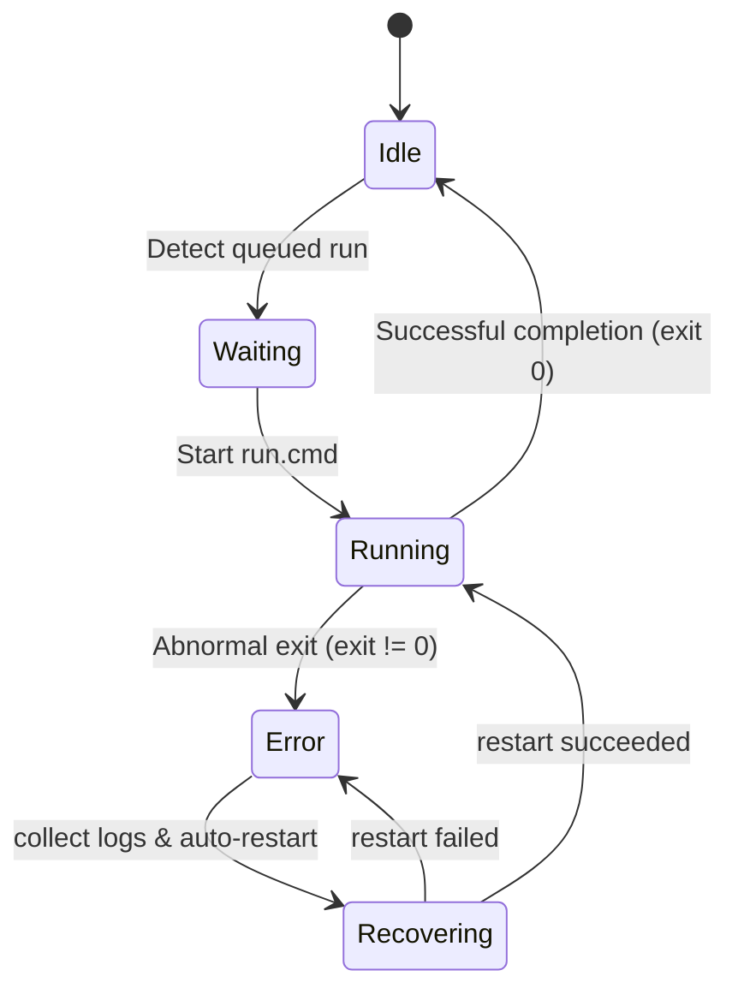

# Runner Auto Start 状態遷移図 (Mermaid)

```mermaid
stateDiagram-v2
    [*] --> Idle
    Idle --> Waiting : Detect queued run
    Waiting --> Running : Start run.cmd
    Running --> Idle : Successful completion (exit 0)
    Running --> Error : Abnormal exit (exit != 0)
    Error --> Recovering : collect logs & auto-restart
    Recovering --> Running : restart succeeded
    Recovering --> Error : restart failed
```

# 整合性チェック
- 許可される状態: Idle, Waiting, Running, Error, Recovering
- スクリプトは `Write-Status` で上の状態を使用することを期待します。
