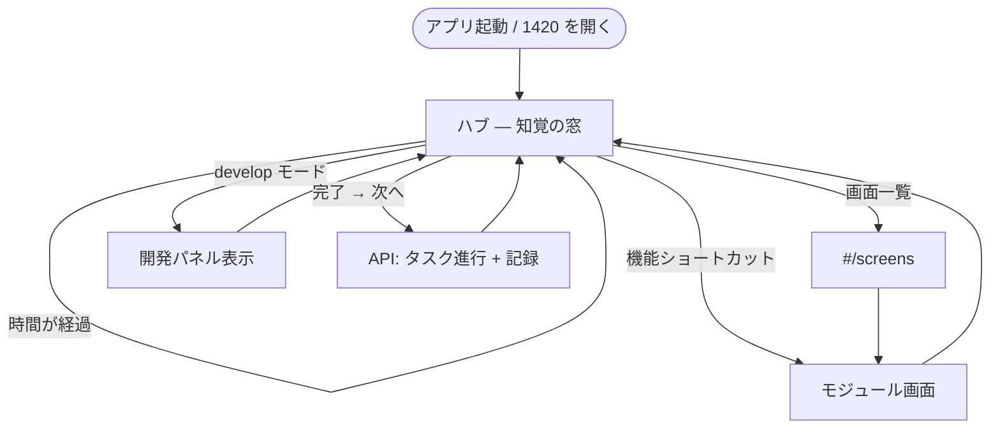
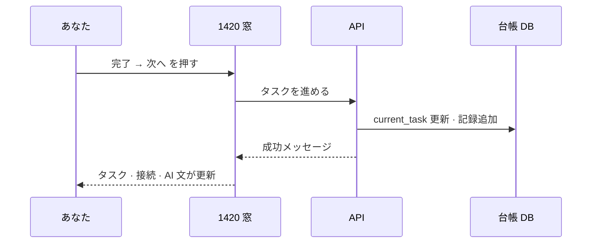

# 04 — 画面遷移とボタン

> **version:** 0.2 · **原則:** ハブ + モジュール画面。遷移は最小。

## 全体遷移図（v0.2）

## ボタン · 操作一覧

| # | UI 上の表示 | 場所 | いつ押せる | 押すと |
|---|-------------|------|------------|--------|
| A-01 | モード（計画/運用/監査/開発） | ヘッダー | 常時 | API モード変更 · develop 時 D-02 表示 |
| A-02 | **完了 → 次へ** | タスクカード | 昼/夕 · API+DB OK · operate/develop | タスクを進める · 記録に追記 |
| A-03 | 書戻し | 開発パネル | develop のみ | URMS → Cursor メモ更新 |
| A-04 | 同期 | 開発パネル | develop のみ | Cursor 側取り込み |
| A-05 | ヘルス | 開発パネル | develop のみ | 連携状態確認 |
| A-06 | 時間帯 · 画面一覧 | 画面下部 | 常時 | 時間帯プレビュー · `#/screens` へ |
| A-07 | 機能ショートカット | ハブカード | 常時 | 天気詳細等のモジュール画面へ |

## A-02「完了 → 次へ」詳細

**失敗時:** ボタン下に理由（API 未起動 · DB 未接続等）— 別画面には行かない。

## 画面が増える場合（S3 以降）

| 候補 | トリガー | 遷移 |
|------|----------|------|
| カレンダー M-CAL-MON | 画面一覧 · ショートカット | `#/M-CAL-MON` |
| 食い違い確認 | 書き戻しで食い違い | モーダル or 専用画面（要設計） |
| Resource 管理 | User が IN に変更 | 要 v0.3 設計 |

v0.2 では **ハブ + モジュール画面（天気詳細まで）+ 画面一覧**。
