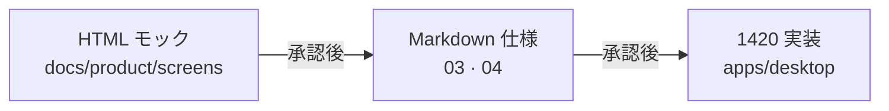

# 05 — 画面モック方式（PM 選定）

> **User:** 判断のみ · 作業不要  
> **選定日:** 2026-07-08

## PM が選んだ方式

**HTML 画面設計書（`docs/product/screens/`）を User 向けビジュアル正本とする。**

| 方式 | 採用 | 理由 |
|------|:----:|------|
| **HTML 画面設計** | ✅ | リポジトリ内 · 差分管理 · あなたはブラウザで開くだけ |
| Figma | ❌ | あなたの作業不要方針 · 外部ツール · 二重管理 |
| 5180 ワイヤー流用 | ❌ | 管理 UI 用 · 1420 と無関係 · 更新停止 |
| 1420 実装をそのまま設計書 | ❌ | **設計 → 実装** の順を崩す（今回の問題の根源） |

## 3 層の役割

| 層 | 正本 | 更新タイミング |
|----|------|----------------|
| **HTML モック** | 見た目 · レイアウト · ラベル | 設計変更時 **最初** |
| Markdown 仕様 | 振る舞い · 条件 · ボタン | HTML と同時 |
| 1420 コード | 動く UI | **User Go 後のみ** |

## モックの見方

1. エクスプローラーで `docs/product/screens/index.html` をダブルクリック  
2. または `npx pnpm wireframes:serve` 相当 — **将来 `product:screens:serve` を追加予定**  
3. 各時間帯リンクから D-01a〜d を確認

## Canvas との関係

| 資産 | 役割 |
|------|------|
| `canvases/urms-user-vision.canvas.tsx` | **雰囲気 · 哲学**（情緒 SSOT） |
| **本 HTML モック** | **画面構成 · ボタン位置**（構造 SSOT） |

矛盾時は **HTML + Markdown（本パック）が優先** → Canvas は追従。

## 内部設計への同期（承認後）

User Go 後、Architect が以下を更新:

- `docs/requirements/ui-requirements.md` → 1420 向け v2 へ改訂  
- `docs/requirements/ui-design-links.md` → 本パックへリダイレクト  
- `docs/implementation/11-phase5-desktop-ui.md` → 本パック参照
