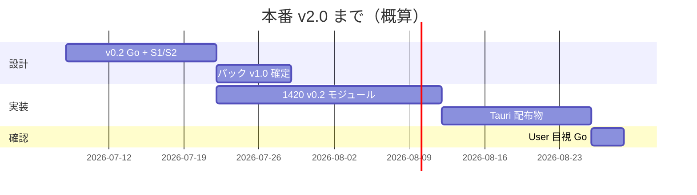

# 06 — 本番の定義と道筋

> **「本番に近い」≠ 本番** — 用語をここで固定します。

## 用語

| 言い方 | 意味 |
|--------|------|
| **1420** | 製品 UI の **開発プレビュー**（Cursor 内タブで見る） |
| **本番 v2.0** | **Windows インストール版**（Tauri アプリ） |
| **版番号 v1.4 等** | プログラム内部の区切り — **製品完成ではない** |

## 本番 v2.0 の完成条件（提案）

| # | 条件 | 確認方法 |
|---|------|----------|
| 1 | 製品設計パック **v1.0 User 承認** | 本フォルダ |
| 2 | v0.2 画面と 1420 が **一致** | 別担当レビュー |
| 3 | Tauri **.exe / インストーラ** がビルドできる | CI または手動 |
| 4 | インストール後 **API+DB なしでも** オフライン表示が破綻しない | 手動 1 回 |
| 5 | 日次ループ **1 サイクル** が User 目視 OK | あなたの Go |

## 道筋（v0.2 Go 後）

**合計目安: v0.2 Go から 6〜8 週**（機能追加なしの場合）

## 今はどこか

| 段階 | 状態 |
|------|------|
| 製品設計 v0.2 | **User Go 済**（2026-07-08） |
| 1420 実装 | **S1 画面基盤 + S2 天気詳細 着手済** |
| Tauri 本番 | **未着手**（v1.0 確定後） |

## PM が継続すること

1. 内部設計書を本パックに同期  
2. 実装差分リスト（設計 vs 1420）を随時更新  
3. 塊レビュー（Go-1）をあなたに依頼
