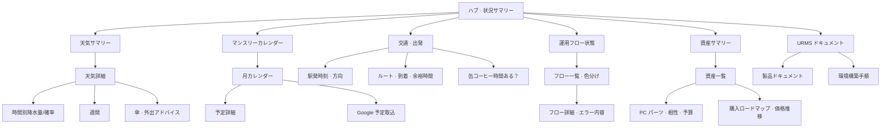

# 07 — URMS 全体像 v0.2（草案 · User 指摘反映）

> **status:** User Go — **2026-07-08**  
> **v0.1 との関係:** v0.1「窓 1 枚 + 時間帯出し分け」は **撤回**。本書が製品の正しい方向性。

---

## 1. PM の謝罪と訂正

v0.1 / 1420 現状は **URMS ではなく、情報カード付きホームページ** に近い。以下を誤解していた。

| 誤解 | 訂正 |
|------|------|
| URMS = トップ 1 画面 | **ハブ + 多数の機能画面** で構成する統合システム |
| 表示条件 = 時間帯（朝/昼/夕/夜）のみ | **あなたが見たいとき · 今必要なとき** に必要な情報を出す（状況エンジン） |
| 天気 = 気温と降水確率の表示 | **詳細画面 + 降水量ベースの判断 + 通勤/外出との組み合わせアドバイス** |
| カレンダー = 未実装でよい | **マンスリー必須** · Google 連携 · 予定種別に応じた事前通知 |
| 資産管理 = 今期 OUT | **URMS の核心の一つ**（PC パーツ · 予算 · 相性 · 購入タイミング等） |

[VISION.md](../project/VISION.md) の「資産を統合的に管理・可視化・最適化」と **一致させる**。

---

## 2. URMS とは（再定義）

**生活 · 移動 · 予定 · 資産 · 運用 · 知識** を、1 つの台帳（SSOT）と AI 判断でつなぎ、  
**「今何をすべきか」「深掘りしたいとき何が見えるか」** の両方を提供する **統合デスクトップアプリ**。

- **トップ（ハブ）** = 今の状況サマリー + 各機能への入口（**製品全体ではない**）
- **機能画面** = 天気詳細 · カレンダー月表示 · 電車案内 · 資産一覧 · 運用フロー詳細 … **多数**
- **拡張** = 動画整理 · ストレージ管理 · ドキュメント閲覧 … **増え続ける前提**

---

## 3. 情報を「いつ出すか」（時間帯以外）

時間帯は **補助信号の一つ** に過ぎない。主な条件例:

| 信号 | 例 | ハブでの振る舞い |
|------|-----|------------------|
| **今すぐ** | 電車 8 分後 · 予定 15 分前 | 最上段 · 強調色 |
| **今日中に準備** | 店予約 · 外出 · 傘判断 | カード + アドバイス文 |
| **近い将来** | 3 日後のイベント · パーツ値下げ | 通知バッジ · 計画提案 |
| **あなたが開いた** | 天気カードをタップ | **即詳細画面**（待たない） |
| **静かな時間** | 深夜 · 予定なし | 情報を圧縮（旧「夜モード」に相当） |

**原則:** ハブは「全部載せない」。**今必要なものを優先**し、残りは機能画面へ。

---

## 4. 画面構成（ハブ + モジュール）

**画面 ID 方針（v0.2）:** `M-{モジュール}-{画面}`（例 `M-WEA-DET` 天気詳細）

---

## 5. モジュール要件（User 追加要件整理）

### 5.1 天気

| 画面 | 内容 |
|------|------|
| サマリー（ハブ） | 今 · 一言アドバイス |
| **詳細** | 週間 · **時間別降水量** · 時間別降水確率 |
| **判断** | 傘要否 — **降水量と時間帯の長さ** を主軸 |

**傘アドバイス例（ルール草案）:**

- ぱらぱら · 約 10 分 · 通勤時間外 → 「傘不要 · 袖で十分」
- 降水量多 · 通勤/帰宅時間帯と重なる → 「傘必須 · ○時台に集中」
- 外出予定（カレンダー連動）開始 30 分前 → 再計算して通知

### 5.2 カレンダー

| 画面 | 内容 |
|------|------|
| ハブ | **マンスリー**（未実装 → **最優先の欠落**） |
| 月表示 | 前月/次月 · 日付タップ → 予定一覧 |
| 連携 | **Google カレンダー** 予定表示 |
| 通知 | 「もうすぐ XX」— 予定種別でリードタイム変更 |

**予定種別とリードタイム例:**

| 種別 | 通知タイミング | アドバイス |
|------|----------------|------------|
| TV 視聴 | 直前で可 | チャンネル/準備不要 |
| 店予約 | **数日前〜前日** | 予約確認 · 移動時間 |
| 外出/通勤 | 当日 · 交通連動 | 出発時刻 · 乗換 |

### 5.3 交通

| 内容 |
|------|
| 指定駅 · 指定方向の **電車出発時刻** |
| **何分前に家を出るか**（徒歩+余裕） |
| **余裕があれば** 缶コーヒー等の短時間余白表示 |
| 指定ルートの **到着予想** |
| カレンダー外出予定 → **出発時刻 + 乗換案内** 自動提示 |

### 5.4 運用フロー

| 内容 |
|------|
| 各フローの **状態表示**（正常 / 警告 / エラー） |
| 異常時 **フロー単位で色変更 · 強調** |
| フロークリック → **詳細画面**（ログ · 次のアクション） |

### 5.5 知識（アプリ内）

| 内容 |
|------|
| **URMS ドキュメント** を URMS 内で閲覧 |
| **環境構築手順書** を URMS 内で実行ガイドとして表示 |

### 5.6 資産管理

| 内容 |
|------|
| 資産一覧 · 詳細 · 履歴 |
| **自作 PC:** パーツ選定 · **相性/互換** · 予算管理 |
| **価格推移** · 購入タイミングアドバイス |
| **アップグレードロードマップ** |

### 5.7 その他（User 言及 · 拡張モジュール）

| モジュール | 概要 |
|------------|------|
| 動画整理 | ライブラリ整理 · メタデータ · 保管方針 |
| ストレージ管理 | 容量 · 分布 · 整理提案 |

**原則:** モジュールは **プラグイン的に追加** できる構造にする（全部を一度に作らない）。

---

## 6. v0.1（1420 現状）とのギャップ

| v0.1 想定 | v0.2 必要 |
|-----------|-----------|
| 画面 6 種 · 遷移ほぼなし | **数十画面規模** の設計が必要 |
| 時間帯 `?phase=` プレビュー | **状況エンジン** + 通常ナビゲーション |
| 天気カード表示のみ | 天気 **詳細階層** + 判断 API |
| 予定「次 N 件」 | **マンスリー + Google + 種別通知** |
| 資産 UI なし | **資産モジュール** 中核 |
| docs は Cursor 外 | **アプリ内ドキュメント** |

---

## 7. 実装の進め方（一括実装しない）

| 段階 | 内容 | 目安 |
|------|------|------|
| **S0** | **本 v0.2 草案 User Go** | 今 |
| **S1** | 画面一覧 v0.2 · ナビモデル · モジュール境界（Architect） | 1 週 |
| **S2** | 天気詳細 + 傘アドバイス（降水量主軸） | 2–3 週 |
| **S3** | マンスリーカレンダー + Google + 種別通知 | 3–4 週 |
| **S4** | 交通モジュール + カレンダー連動 | 3–4 週 |
| **S5** | 運用フロー UI | 2 週 |
| **S6** | アプリ内ドキュメント | 1–2 週 |
| **S7** | 資産管理（PC パーツ含む） | 継続 |
| **S8+** | 動画 · ストレージ · … | 順次 |

**v0.1 の「6 画面で完成」定義は廃止。**

---

## 8. あなたへの確認（判断）

1. **本 v0.2 の方向** — Go / 修正  
2. **最初に実装するモジュール** — 天気詳細 / カレンダー / 交通 / 資産 / 運用フロー の優先順  
3. **Google カレンダー** — 連携必須で Go か  
4. **ハブの見た目** — 窓のトーン（暗色 · 余白）は **維持** か · **管理画面寄りも混ぜる** か

---

## 変更履歴

| 日付 | 変更 |
|------|------|
| 2026-07-08 | v0.2 草案 — User 指摘「1 画面ホームページではない」反映 |
